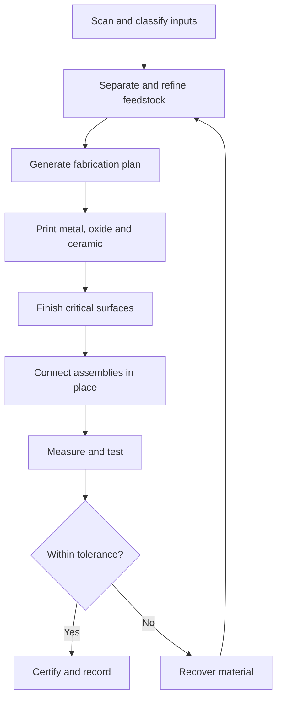

# Closed-Loop Robot Microfactory

## Project status

This repository document records Kris's proposed household robot microfactory and oxide-computing research program. It separates:

- **Design requirements** — what the finished system is intended to do.
- **Supported mechanisms** — effects already demonstrated in materials science or manufacturing.
- **Research hypotheses** — ideas that require controlled experiments.
- **Safety boundaries** — functions that cannot be prototyped safely inside a home.

The project begins with a correction loop: when a person challenges an AI answer, the system records the claim, evidence, experiment, result, and revised model. Corrections are not accepted or rejected by authority alone; they become testable engineering questions.

---

## 1. Priority unresolved research

These questions govern the project. Work on downstream robot production should not outrun the evidence required here.

| Priority | Unresolved question | Why it comes first | Required proof |
|---:|---|---|---|
| P0 | Can a fabricated oxide–boron cell be written, read, reset, and rewritten reliably? | The proposed computer core depends on repeatable state storage. | Blind readout tests, endurance cycles, retention measurements, and independent reproduction |
| P0 | Can controlled vibration or phonon excitation move or stabilize useful defect states? | This is the proposed oxide-to-oxide signal carrier. | Frequency-response maps separating vibration effects from heat and ordinary electrical switching |
| P0 | What physical state constitutes the boron imprint? | “Missing spaces” must correspond to measurable vacancies, trapped charge, resistance, or optical states. | Structural imaging plus correlated electrical and optical measurements |
| P0 | Can energy and information cross adjacent printed oxide regions without discrete wiring? | The monolithic circuit depends on a verified coupling mechanism. | Measured transfer efficiency, distance, bandwidth, error rate, and energy per pulse |
| P1 | Can aluminum-can feedstock produce repeatable electronic-grade oxide structures? | Coatings, alloying elements, and contamination may dominate device behavior. | Composition analysis, purification yield, oxide uniformity, and device-to-device variance |
| P1 | Can process oxygen, electrolytes, cathodes, water, and heat be recovered in a practical loop? | Closed-loop manufacturing requires quantified recovery rather than assumed reuse. | Complete mass and energy balances across repeated cycles |
| P1 | Can a molecular target create a selective, readable, reversible imprint? | Molecular collection and assembly require specificity. | Blind target/control trials, false-positive rate, reset cycles, and degradation data |
| P1 | Can captive metal mechanisms be printed in place with useful motion and near-zero play? | Robot assembly depends on connected moving parts. | Clearance coupons, torque, wear, contamination, thermal-expansion, and load tests |
| P2 | Which robot components can actually be fabricated from aluminum, oxides, boron compounds, and recovered fluids? | The self-production ratio must be based on demonstrated components. | Component-by-component material, process, tolerance, and test records |
| P2 | Which imported bootstrap components remain unavoidable? | Processors, magnets, batteries, cameras, and bearings cannot be treated as solved. | Dependency ledger and a research plan for replacing each dependency |
| P2 | What energy source and thermal architecture can run safely in a home? | High-temperature processing cannot proceed without containment and energy accounting. | Thermal model, emissions control, shutdown behavior, and applicable safety review |
| P3 | Can the fabrication cell reproduce verified parts of itself? | Self-replication is the final dependency, not the starting assumption. | Printed replacement component, automated installation, calibration, and equivalence testing |

### Research execution order

1. Build the measurement and conservation ledger.
2. Establish safe aluminum-to-oxide reference samples.
3. Fabricate and characterize one oxide–boron memory cell.
4. Isolate electrical, thermal, optical, ionic, and vibrational effects.
5. Demonstrate repeatable state transfer between two adjacent cells.
6. Test molecular imprinting with known safe controls.
7. Validate print-in-place mechanical coupons.
8. Integrate only mechanisms that pass predefined success criteria.
9. Publish failures and revised hypotheses alongside successful results.
10. Increase the self-production ratio only after each subsystem is measured.

### Correction protocol

When Kris or another contributor corrects an AI-generated limitation or interpretation, the correction becomes a prioritized research record containing:

- Original statement
- Proposed correction
- Competing physical explanations
- Measurement capable of distinguishing them
- Safety and equipment requirements
- Raw observations
- Result and confidence
- Revised engineering rule

The system must learn from demonstrated corrections while keeping unresolved claims visible instead of silently converting them into established facts.

---

## 2. Core vision

The final device is a programmable household microfactory that:

1. Accepts recovered material such as aluminum cans, beverage containers, damaged parts, water, and useful chemical streams.
2. Identifies, weighs, cleans, separates, and characterizes every input.
3. Converts feedstock into metals, oxides, ceramics, conductors, insulators, and reusable process fluids.
4. Prints robot structures, joints, fasteners, signal paths, memory, sensors, and repair components.
5. Measures every feature during fabrication.
6. Connects components in their final positions whenever practical.
7. Tests mechanical motion, electrical behavior, material composition, and structural integrity before activation.
8. Recycles failed prints and worn components instead of using planned obsolescence.
9. Improves its self-production percentage with each generation.

External components are permitted only as documented bootstrap dependencies. Each imported component creates a future localization task.

---

## 3. System metric: self-production ratio

```text
self-production ratio =
  mass fabricated and connected inside the microfactory
  ----------------------------------------------------- × 100%
                  total finished robot mass
```

The ledger must also track:

- Material recovery percentage
- Energy consumed per kilogram
- Water recovered
- Number of external components
- Dimensional yield
- Component reuse cycles
- Repairability
- Waste and contamination
- Verified service life

---

## 4. Closed-loop workflow



Every transformation is entered in a conservation ledger:

```text
input mass = product mass + recovered material + measured emissions + measured loss
input energy = stored energy + useful work + recoverable heat + measured loss
```

Matter is transformed rather than destroyed. In chemistry, “consumed” means converted into another chemical state.

---

## 5. Aluminum-to-oxide cycle

Aluminum recovered from a can can provide structural material, electrodes, heat paths, and oxide precursors.

The simplified oxidation relationship is:

```text
4 Al + 3 O₂ → 2 Al₂O₃ + released energy
```

Reversal requires energy:

```text
2 Al₂O₃ + energy → 4 Al + 3 O₂
```

### Electrochemical distinction

During anodizing, the aluminum workpiece is the **anode**. Oxide grows on that aluminum. A reusable cathode completes the circuit, but it does not eliminate the need for aluminum, oxygen-bearing chemistry, electricity, and process control.

The machine should investigate:

- Controlled anodic oxide growth
- Nanoporous anodic aluminum oxide
- Reusable cathodes
- Electrolyte recovery
- Oxygen capture and recirculation
- Oxide stripping and aluminum recovery
- Contamination measurement
- Energy recovery between process stages

Other metals require individual oxide recipes. They cannot all be processed with one universal voltage, electrolyte, temperature, or atmosphere.

---

## 6. Monolithic print-in-place construction

The robot should be fabricated as connected assemblies rather than as loose pieces requiring extensive manual assembly.

Candidate techniques:

- Captive screws printed inside matching threaded bodies
- Split nuts and compliant preload features
- Tapered threads
- Snap fits and dovetails
- Print-in-place hinges and bearings
- Breakaway stabilizers
- Sacrificial separation layers
- Internal material-removal channels
- Embedded coils and conductive paths
- Printed insulation between conductive regions
- Automatic torque, pullout, motion, and leakage testing

### Clearance principle

The objective is **functionally zero play**, not a literal nanometer-scale printed air gap. Surface roughness, oxide growth, thermal expansion, and debris would bind a nanometer mechanical interface.

Initial research ranges:

| Interface | Starting clearance |
|---|---:|
| Polymer sliding joint | 0.20–0.50 mm |
| Precision resin joint | 0.10–0.30 mm |
| Metal additive joint before finishing | 0.10–0.50 mm |
| Precision-finished aluminum fit | 0.01–0.05 mm |
| Research target with active compliance | 20–100 μm |

The machine measures the actual printed geometry and automatically compensates in subsequent builds.

---

## 7. Oxide–boron computational lattice

The proposed computer core is not a conventional board connected by separate wires. It is a monolithic material system in which structure, insulation, sensing, memory, and signal transfer are printed as interacting regions.

### Signal model

```text
input pulse
→ oxide-lattice vibration
→ electron/ion response
→ vacancy or defect-state change
→ boron-region imprint
→ electrical or optical readout
```

A quantized lattice vibration is a **phonon**. Candidate coupling mechanisms include:

- Phonon transport
- Piezoelectric coupling
- Electric-field coupling
- Capacitive coupling
- Optical pulses
- Ionic conduction
- Oxygen-vacancy migration
- Memristive resistance changes
- Magnetic coupling where appropriate

“No wires” means minimizing discrete wiring through adjacent printed functional regions. It does not mean information or energy travels without a physical coupling mechanism.

### Candidate functional regions

| Printed region | Intended function |
|---|---|
| Dense aluminum | Structure, electrode, heat path |
| Aluminum oxide | Insulator, dielectric, protective layer |
| Nanoporous aluminum oxide | Template and molecular capture surface |
| Oxygen-deficient oxide | Variable conductor |
| Transition-metal oxide | Switching and memristive memory |
| Piezoelectric oxide | Vibration/electric conversion |
| Boron-containing layer | Defect-state research |
| Hexagonal boron nitride | Insulating or memristive research layer |
| Capacitive junction | Pulse transfer without direct conductive contact |

---

## 8. Molecular capture and imprinting

Each oxide–boron cell is intended to sense, collect, organize, and record molecular information.

Two forms of imprinting must be distinguished:

### Geometric imprint

A target molecule is temporarily surrounded by deposited material and removed, leaving a cavity that reproduces relevant geometry and binding locations.

### Electronic imprint

The molecule changes nearby:

- Charge distribution
- Electron trapping
- Optical response
- Polarization
- Resistance
- Vacancy location
- Vibrational spectrum

A boron-containing region records a defect or resistance signature associated with that molecule. The stored state is not assumed to be a literal miniature picture. Software reconstructs molecular identity or configuration from measured defect, electrical, optical, and vibrational data.

### Atomic-pixel hypothesis

An oxide–boron “atomic pixel” would:

1. Capture a molecule or atomic cluster.
2. Apply a controlled electrical, thermal, optical, or vibrational pulse.
3. Measure electron, ion, phonon, and resistance responses.
4. Write a defect-state signature.
5. Read the signature repeatedly.
6. Erase or reset the cell.
7. Report degradation after each cycle.

Large arrays of these cells could guide material placement and retain fabrication state.

---

## 9. Beverage-container processing

The container and its fluid contents enter separate processing paths.

### Container path

- Identify alloy and coating
- Remove paint, polymer lining, and contamination
- Clean and weigh
- Melt, cast, atomize, extrude, or machine
- Route a measured fraction into oxide production
- Recover off-gas and process residues

### Jacobs water-filtration path

The fluid system investigates recovery of:

- Water
- Carbon dioxide
- Dissolved carbon compounds
- Sugars
- Organic acids
- Mineral salts
- Cleaning and electrolyte ingredients
- Carbon precursors
- Limited chemical energy

Every output must be chemically identified before reuse. Beverage fluid alone is not assumed to supply all energy or elements needed for a robot.

---

## 10. Fabrication stations

The full microfactory requires coordinated modules:

1. **Input metrology** — imaging, spectroscopy, weighing, dimensional scanning.
2. **Cleaning and separation** — removes coatings, fluids, corrosion, and mixed materials.
3. **Material preparation** — produces wire, powder, pellet, sheet, slurry, or machining stock.
4. **Oxide cell** — grows or deposits controlled oxide structures.
5. **Metal fabrication** — additive deposition, casting, forming, and machining.
6. **Ceramic fabrication** — powder preparation, binding, deposition, and sintering.
7. **Conductive-path printing** — electrodes, coils, and embedded signal regions.
8. **Precision finishing** — milling, grinding, polishing, and thread finishing.
9. **In-place assembly** — captive mechanisms and robotic manipulation.
10. **Inspection** — optical, dimensional, thermal, electrical, acoustic, and force testing.
11. **Recovery** — reprocesses rejected or worn material.
12. **Certification ledger** — records composition, tolerances, tests, provenance, and repair history.

---

## 11. Energy architecture

The microfactory needs high-grade heat and electricity, but an experimental household nuclear reactor is outside the safe prototype scope.

The machine should expose a standardized energy interface supporting:

- Grid electricity
- Solar electricity
- Induction heating
- Resistance heating
- Microwave or radio-frequency process heating
- Thermal storage
- Recoverable process heat
- A future licensed external nuclear-energy source

A nuclear source, if ever used, remains a separately licensed and contained energy facility. The printer consumes its delivered heat or electricity; nuclear fuel and reactor control do not belong in the household fabrication chamber.

---

## 12. Development generations

### Generation 0 — Measurement rig

- Classify aluminum inputs
- Measure mass and surface chemistry
- Grow controlled aluminum-oxide films
- Record voltage, current, temperature, thickness, and porosity
- Recycle process fluids where verified

### Generation 1 — Oxide memory cell

- Print aluminum electrode and oxide
- Add a candidate memristive oxide
- Add a boron-containing layer
- Write and read resistance states
- Measure retention, endurance, and failure modes

### Generation 2 — Vibrational carrier array

- Build coupled oxide cells
- Generate controlled phonon or acoustic excitation
- Measure propagation and attenuation
- Correlate frequency with vacancy movement and conductivity
- Test whether resonance reduces switching energy

### Generation 3 — Molecular imprint cell

- Capture a known safe reference molecule
- Create geometric and electronic signatures
- Remove the reference
- Test selective rebinding and readout
- Quantify false positives and reset cycles

### Generation 4 — Print-in-place mechanism

- Print captive screw and compliant nut
- Measure clearances automatically
- Remove sacrificial separation material
- Conduct torque, wear, load, and recycling tests

### Generation 5 — Small service robot

- Fabricate frame, housing, joints, conductors, sensors, and repair parts
- Import only ledgered bootstrap components
- Demonstrate fault detection and local replacement
- Publish the self-production ratio

### Generation 6 — Replicating fabrication cell

- Print a verified subset of the microfactory's own components
- Install and calibrate them robotically
- Compare new components with master measurements
- Increase self-production percentage without sacrificing safety

---

## 13. First experiment

**Objective:** determine whether a printed oxide–boron cell can be written, read, reset, and rewritten using controlled electrical and vibrational excitation.

### Inputs

- Characterized aluminum substrate
- Controlled aluminum-oxide layer
- Candidate switching oxide
- Boron-containing or boron-nitride layer
- Reusable electrodes
- Temperature, voltage, current, vibration, and optical sensors

### Variables

- Oxide composition and thickness
- Vacancy concentration
- Pulse voltage and duration
- Excitation frequency
- Temperature
- Crystal orientation
- Mechanical strain
- Electrode spacing

### Success criteria

- At least two distinguishable states
- Repeatable write/read cycles
- Measured retention time
- Reset capability
- Known energy per operation
- Correlation between excitation and state change
- Documented degradation threshold
- Independent reproduction of results

---

## 14. Research ledger

Every proposed mechanism receives one status:

| Status | Meaning |
|---|---|
| Observed | Directly measured in this project |
| Reproduced | Independently repeated |
| Supported | Established mechanism with relevant published evidence |
| Hypothesis | Plausible but unverified in this architecture |
| Speculative | No adequate experimental support yet |
| Rejected | Contradicted by measurement |
| Revised | Changed following evidence or human correction |

Each record contains:

- Claim
- Originator
- Date
- Proposed mechanism
- Required materials
- Measurement method
- Safety review
- Experimental result
- Raw data
- Interpretation
- Competing explanations
- Revised claim
- Next action

---

## 15. Non-planned-obsolescence rules

- No arbitrary expiration dates.
- Replace components according to measured condition.
- Publish repair instructions and material composition.
- Use reversible connections where service is needed.
- Preserve backward-compatible control interfaces.
- Permit owner-controlled firmware.
- Maintain complete component provenance.
- Prefer recyclable mono-material structures where performance allows.
- Test recovered material before returning it to structural service.
- Never hide a safety-critical wear condition to extend nominal service life.

---

## 16. Immediate backlog

- [ ] Define the material and energy ledger schemas.
- [ ] Draw the Generation 0 anodic-oxide test cell.
- [ ] Select safe reference oxides for the first memory experiment.
- [ ] Specify reusable electrode and electrolyte-recovery requirements.
- [ ] Design the oxide–boron atomic-pixel test coupon.
- [ ] Define phonon excitation and measurement equipment.
- [ ] Establish write/read/reset success thresholds.
- [ ] Design three captive-screw clearance coupons.
- [ ] Add automated dimensional inspection.
- [ ] Define the Jacobs fluid-stream classification table.
- [ ] Calculate mass and energy balances for one aluminum can.
- [ ] Identify every externally sourced bootstrap component.
- [ ] Create a self-production-ratio dashboard.
- [ ] Establish household, laboratory, and licensed-facility safety boundaries.
- [ ] Record corrections and failed hypotheses in the research ledger.

---

## 17. Guiding principle

The system is meant to learn through correction and measurement. Human insight generates hypotheses; AI organizes them; instruments decide whether a claimed mechanism is repeatable. The long-term objective is a durable household fabrication system that transforms recovered material into useful machines while retaining local ownership, repairability, and transparent evidence.
